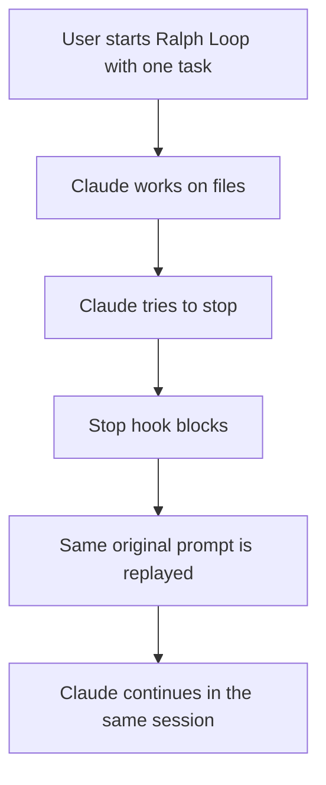
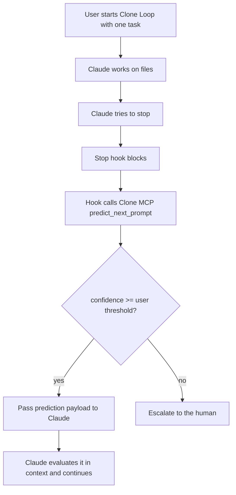

# Clone

Clone is a Claude Code plugin that runs Clone Loop: a Ralph-style automation
loop upgraded with Clone MCP next-prompt prediction.

It vendors Anthropic's official `ralph-loop` plugin, keeps the same Stop hook
lifecycle, and changes one key thing: instead of replaying the same prompt,
Clone Loop asks Clone what the user would probably say next.

Based on Anthropic Ralph Loop, modified by Clone. The included Ralph Loop code
is licensed under Apache-2.0; see `LICENSE`.

## Why Clone Loop

Ralph Loop keeps Claude Code working by replaying the original task whenever
Claude tries to stop.



Clone Loop keeps the same loop, but replaces "repeat the same prompt" with
"ask Clone what the user would probably say next."



| Area | Ralph Loop | Clone Loop |
| --- | --- | --- |
| Next instruction | Same original prompt | Hook-mediated Clone prediction |
| Personalization | None | User memory through `predict_next_prompt` |
| Safety | Max iterations and completion promise | Same checks plus confidence threshold and MCP failure escalation |

## Plugin Structure

The original Ralph Loop files are kept for compatibility:

```text
.claude-plugin/plugin.json     Plugin metadata for Claude Code.
commands/ralph-loop.md         Starts the loop by running the setup script.
commands/cancel-ralph.md       Removes the loop state file.
commands/help.md               Explains Ralph Loop to the user.
hooks/hooks.json               Registers a Stop hook.
hooks/stop-hook.sh             Blocks stop and re-injects the prompt.
scripts/setup-ralph-loop.sh    Parses options and writes loop state.
README.md                      User documentation.
LICENSE                        Apache-2.0 license from Ralph Loop.
```

Clone adds `/clone:loop`, `/clone:cancel-loop`, `.claude/clone-loop.local.md`,
and Clone MCP prediction settings (`--clone-threshold`, `--clone-k`,
`--clone-agent`).

## Versions

- `0.1.x` / v1: Claude-mediated MCP. The Stop hook asked Claude to call
  `mcp__clone__predict_next_prompt`.
- `0.2.x` / v2: hook-mediated MCP. The Stop hook calls Clone MCP directly,
  gates only on the user-configured confidence threshold, then passes the
  prediction payload to Claude for continuation.

## Requirements

- Claude Code with plugin support.
- `CLONE_API_TOKEN` exported in the shell that launches Claude Code.
- Optional Claude MCP permission for manual `mcp__clone__predict_next_prompt`
  calls. The v2 loop path calls Clone MCP directly from the Stop hook.

Runtime shell requirements differ by OS:

- macOS / Linux: `bash`, `node`, `perl`, `sed`, and `awk` must be on `PATH`.
- Windows: Git for Windows is required, and `bash` should resolve to
  `C:\Program Files\Git\bin\bash.exe` rather than WSL's
  `C:\Windows\System32\bash.exe`.

Ralph Loop uses `jq` for JSON parsing. Clone Loop uses Node instead, so Windows
does not need a separate `jq` install when Git Bash is present.

Clone's direct remote MCP endpoint is registered in `.mcp.json`:

```json
{
  "mcpServers": {
    "clone": {
      "url": "https://api.clone.is/mcp",
      "headers": {
        "X-Clone-API-Key": "${CLONE_API_TOKEN}"
      }
    }
  }
}
```

Smithery can also manage the same server:

```bash
smithery mcp add clone/clone --headers '{"cloneApiKey":"your-clone-api-key"}'
```

The plugin defaults to the direct endpoint so Claude Code only needs
`CLONE_API_TOKEN`.

## OS Setup

### macOS / Linux

```bash
export CLONE_API_TOKEN="clone_yc-reviewer-public-demo-2026"
command -v bash node perl sed awk
claude plugin validate apps/claude-plugin
```

### Windows

```powershell
$env:CLONE_API_TOKEN = "clone_yc-reviewer-public-demo-2026"
Get-Command bash
Get-Command node
Get-Command perl
Get-Command sed
Get-Command awk
claude.exe plugin validate apps\claude-plugin
```

`Get-Command bash` should point to Git Bash:

```text
C:\Program Files\Git\bin\bash.exe
```

If it points to `C:\Windows\System32\bash.exe`, Claude Code may try to use WSL.
Fix `PATH` so Git Bash comes first, or edit the installed plugin cache
`hooks/hooks.json` to use Git Bash explicitly:

```json
"command": "\"C:/Program Files/Git/bin/bash.exe\" \"${CLAUDE_PLUGIN_ROOT}/hooks/stop-hook.sh\""
```

## Usage

Start Clone Loop:

```bash
/clone:loop "Build a REST API for todos. Requirements: CRUD operations, validation, tests. Output <promise>COMPLETE</promise> when done." --completion-promise "COMPLETE" --max-iterations 20
```

Recommended options:

```bash
/clone:loop "Fix the auth bug and run tests" \
  --max-iterations 10 \
  --completion-promise "COMPLETE" \
  --clone-threshold 0.8 \
  --clone-k 1
```

Cancel the loop:

```bash
/clone:cancel-loop
```

## How It Works

1. `/clone:loop` writes `.claude/clone-loop.local.md`.
2. Claude works on the task.
3. When Claude tries to stop, `hooks/stop-hook.sh` runs.
4. The hook keeps Ralph safety checks: session isolation, corrupted-state
   cleanup, max iterations, and completion promise.
5. If the loop continues, the hook calls Clone MCP `predict_next_prompt`
   directly with the original prompt, iteration, threshold, and
   `last_assistant_message`.
6. If confidence clears the user-configured threshold, the hook passes the
   prediction payload to Claude. Claude evaluates it in context and continues
   as if the user had provided the predicted prompt.
7. If confidence is too low or MCP fails, the loop state is removed and the
   human is asked to continue.

## Options

- `--max-iterations <n>`: stop after N iterations. `0` means unlimited.
- `--completion-promise <text>`: phrase that must appear inside
  `<promise>...</promise>` to complete the loop.
- `--clone-threshold <n>`: Clone confidence threshold in `[0, 1]`; default
  `0.8`.
- `--clone-k <n>`: number of Clone candidate prompts to request, `1-10`;
  default `1`.
- `--clone-agent <text>`: agent label sent to Clone; default
  `Claude Code Clone Loop`.

## Prompt Guidance

Use explicit success criteria and automated verification:

```markdown
Implement feature X using TDD.

Success criteria:
- Tests cover happy path and failure path
- `npm test` passes
- README documents the new command
- Output <promise>COMPLETE</promise> only when all criteria are true
```

Always set a reasonable `--max-iterations`.

## Development

macOS / Linux:

```bash
cd apps/claude-plugin
npm test
npm run test:mcp
```

Windows PowerShell:

```powershell
Set-Location apps\claude-plugin
npm test
npm run test:mcp
```

`npm run test:mcp` calls the live Clone MCP endpoint and uses the public YC
reviewer demo key by default. To test another account:

```bash
export CLONE_API_TOKEN="clone_xxx"
npm run test:mcp
```

```powershell
$env:CLONE_API_TOKEN = "clone_xxx"
npm run test:mcp
```

Validate with Claude Code on macOS / Linux:

```bash
claude plugin validate apps/claude-plugin
```

Validate with Claude Code on Windows:

```powershell
claude.exe plugin validate apps\claude-plugin
```
