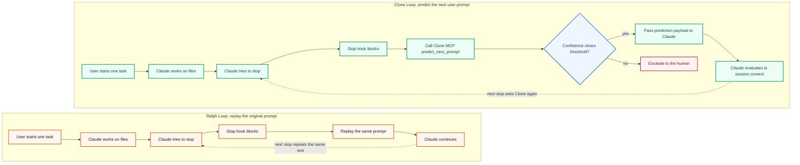

# Clone

Clone is a Claude Code plugin that runs Clone Loop: an automation loop powered
by Clone MCP next-prompt prediction.

Clone Loop keeps Claude Code working inside the same session. When Claude tries
to stop, the Stop hook calls Clone MCP, receives a predicted next prompt, and
continues only when the prediction clears the configured confidence threshold.

## Quick Install

Install from your shell:

```bash
claude plugin marketplace add cloneisyou/clone-claude-plugin@main
claude plugin install clone@clone-labs --scope user
```

If `clone-labs` is already added on this machine, the install command alone is
enough.

Or install from inside Claude Code:

```text
/plugin marketplace add cloneisyou/clone-claude-plugin@main
/plugin install clone@clone-labs
```

Then start a loop:

```text
/clone:loop "Run tests and fix any failures" --max-iterations 5 --clone-threshold 0.8
```

## Ralph Loop vs Clone Loop

> [!TIP]
> Read the difference as **replay vs predict**. Ralph Loop keeps the session
> alive by replaying the original prompt. Clone Loop keeps the same hook shape,
> but asks Clone what the user would probably say next.

Ralph Loop is the baseline repeat loop: useful when the original instruction
should simply be retried, but limited when the session needs a more specific
next nudge. Clone Loop replaces that repeated prompt with a confidence-gated
Clone MCP prediction.



> [!IMPORTANT]
> Clone Loop does not blindly continue on any generated text. The Stop hook
> only passes a Clone prediction to Claude when confidence clears the configured
> threshold; otherwise it removes loop state and asks for human input.

| Question | Ralph Loop | Clone Loop |
| --- | --- | --- |
| What happens after stop? | Replays the original prompt. | Calls Clone MCP for a predicted next prompt. |
| Best fit | Simple retry loops where the same instruction remains valid. | Iterative work where the next useful nudge may change. |
| Personalization | None. | Uses Clone's prediction path through `predict_next_prompt`. |
| Safety boundary | Max iterations and completion promise. | Same checks plus confidence threshold and MCP failure escalation. |
| Failure mode | Can keep pushing stale instructions. | Stops when Clone is not confident enough. |

## Plugin Structure

The plugin is organized around Clone Loop names only:

```text
.claude-plugin/plugin.json     Plugin metadata for Claude Code.
commands/loop.md               Starts Clone Loop with /clone:loop.
commands/cancel-loop.md        Cancels the active Clone Loop.
commands/help.md               Explains Clone Loop to the user.
hooks/hooks.json               Registers a Stop hook.
hooks/stop-hook.sh             Blocks stop and injects Clone predictions.
scripts/setup-clone-loop.sh    Parses options and writes loop state.
README.md                      User documentation.
LICENSE                        Apache-2.0 license.
```

The primary user commands are `/clone:loop` and `/clone:cancel-loop`. Loop state
lives in `.claude/clone-loop.local.md`, with Clone MCP prediction settings
stored beside the original prompt.

## Versions

> [!TIP]
> Use `0.2.x` unless you specifically need to compare against v1. v2 is the
> hook-mediated path that calls Clone MCP directly from the Stop hook.

- `0.1.x` / v1: Claude-mediated MCP. The Stop hook asked Claude to call
  `mcp__clone__predict_next_prompt`.
- `0.2.x` / v2: hook-mediated MCP. The Stop hook calls Clone MCP directly,
  gates only on the user-configured confidence threshold, then passes the
  prediction payload to Claude for continuation.

## Requirements

- Claude Code with plugin support.
- Optional `CLONE_API_TOKEN` exported in the shell that launches Claude Code.
  If unset, Clone Loop uses the public YC reviewer demo key shown on
  https://clone.is/you.
- Optional Claude MCP permission for manual `mcp__clone__predict_next_prompt`
  calls. The v2 loop path calls Clone MCP directly from the Stop hook.

Runtime shell requirements differ by OS:

- macOS / Linux: `bash`, `node`, `perl`, `sed`, and `awk` must be on `PATH`.
- Windows: Git for Windows and Node are required. Clone uses a Node launcher
  to call Git Bash directly, so `bash` may resolve to WSL as long as Git Bash
  is installed at `C:\Program Files\Git\bin\bash.exe` or `CLONE_BASH_PATH`
  points to the Git Bash executable.

Clone Loop uses Node for JSON parsing, so Windows does not need a separate
`jq` install when Git Bash is present.

> [!IMPORTANT]
> On Windows, do not run Clone Loop through WSL Bash. If Git for Windows is not
> installed in the standard location, set `CLONE_BASH_PATH` to the Git Bash
> executable before launching Claude Code.

Clone's direct remote MCP endpoint is registered in `.mcp.json`:

```json
{
  "mcpServers": {
    "clone": {
      "url": "https://api.clone.is/mcp",
      "headers": {
        "X-Clone-API-Key": "${CLONE_API_TOKEN:-clone_yc-reviewer-public-demo-2026}"
      }
    }
  }
}
```

Smithery can also manage the same server:

```bash
smithery mcp add clone/clone --headers '{"cloneApiKey":"your-clone-api-key"}'
```

The Stop hook defaults to the direct endpoint and falls back to the public YC
reviewer demo key when `CLONE_API_TOKEN` is unset. Set `CLONE_API_TOKEN` to use
your own Clone memory and avoid the shared demo environment.

## OS Setup

> [!NOTE]
> These commands only prepare the environment and validate the plugin. For
> installation commands, jump to [Installation Commands](#installation-commands).

### macOS / Linux

```bash
command -v bash node perl sed awk
claude plugin validate .
```

### Windows

```powershell
Get-Command node
Get-Command perl
Get-Command sed
Get-Command awk
Test-Path "C:\Program Files\Git\bin\bash.exe"
claude.exe plugin validate .
```

If Git for Windows is installed somewhere else, set `CLONE_BASH_PATH`:

```powershell
$env:CLONE_BASH_PATH = "D:\Apps\Git\bin\bash.exe"
```

## Usage

> [!TIP]
> Start with a small `--max-iterations` value while testing the loop. Increase
> it once the prompt and completion promise are behaving well.

Start Clone Loop:

```bash
/clone:loop "Build a REST API for todos. Requirements: CRUD operations, validation, tests. Output <promise>COMPLETE</promise> when done." --completion-promise "COMPLETE" --max-iterations 20
```

Recommended options:

```bash
/clone:loop "Fix the auth bug and run tests" \
  --max-iterations 10 \
  --completion-promise "COMPLETE" \
  --clone-threshold 0.8 \
  --clone-k 1
```

Cancel the loop:

```bash
/clone:cancel-loop
```

## How It Works

1. `/clone:loop` writes `.claude/clone-loop.local.md`.
2. Claude works on the task.
3. When Claude tries to stop, `hooks/stop-hook.sh` runs.
4. The hook keeps Clone Loop safety checks: session isolation, corrupted-state
   cleanup, max iterations, and completion promise.
5. If the loop continues, the hook calls Clone MCP `predict_next_prompt`
   directly with the original prompt, iteration, threshold, and
   `last_assistant_message`.
6. If confidence clears the user-configured threshold, the hook passes the
   prediction payload to Claude. Claude evaluates it in context and continues
   as if the user had provided the predicted prompt.
7. If confidence is too low or MCP fails, the loop state is removed and the
   human is asked to continue.

## Options

- `--max-iterations <n>`: stop after N iterations. `0` means unlimited.
- `--completion-promise <text>`: phrase that must appear inside
  `<promise>...</promise>` to complete the loop.
- `--clone-threshold <n>`: Clone confidence threshold in `[0, 1]`; default
  `0.8`.
- `--clone-k <n>`: number of Clone candidate prompts to request, `1-10`;
  default `1`.
- `--clone-agent <text>`: agent label sent to Clone; default
  `Claude Code Clone Loop`.

## Prompt Guidance

Use explicit success criteria and automated verification:

```markdown
Implement feature X using TDD.

Success criteria:
- Tests cover happy path and failure path
- `npm test` passes
- README documents the new command
- Output <promise>COMPLETE</promise> only when all criteria are true
```

Always set a reasonable `--max-iterations`.

## Development

> [!IMPORTANT]
> `npm run test:mcp` calls the live Clone MCP endpoint. The test uses the public
> YC reviewer demo key by default, so do not record sensitive data there.

macOS / Linux:

```bash
npm test
npm run test:mcp
```

Windows PowerShell:

```powershell
npm test
npm run test:mcp
```

To test another account:

```bash
export CLONE_API_TOKEN="clone_xxx"
npm run test:mcp
```

```powershell
$env:CLONE_API_TOKEN = "clone_xxx"
npm run test:mcp
```

Validate with Claude Code on macOS / Linux:

```bash
claude plugin validate .
```

Validate with Claude Code on Windows:

```powershell
claude.exe plugin validate .
```

## Installation Commands

> [!TIP]
> Use v2 by default. It is the hook-mediated Clone MCP version.

> [!IMPORTANT]
> The `clone-labs` marketplace below is the Clone Labs marketplace hosted from
> this GitHub repository. It is not the official Anthropic
> `claude-plugins-official` marketplace. Official listing requires submission
> through the Claude plugin directory.

> [!NOTE]
> This repository contains only the Clone Claude Code plugin. The main Clone
> monorepo consumes it as a git submodule.

Plugin install IDs use `plugin@marketplace` order. For this repository, the
plugin is `clone` and the marketplace is `clone-labs`, so the install ID is
`clone@clone-labs`.

Set `CLONE_API_TOKEN` before launching Claude Code to use your own Clone
memory. If it is unset, Clone Loop uses the public YC reviewer demo key.

### macOS / Linux: Clone Labs Marketplace Install

```bash
claude plugin marketplace add cloneisyou/clone-claude-plugin@main
claude plugin install clone@clone-labs --scope user
claude
```

Then run inside Claude Code:

```text
/clone:loop "Run tests and fix any failures" --max-iterations 5 --clone-threshold 0.8
```

### Windows PowerShell: Clone Labs Marketplace Install

```powershell
claude.exe plugin marketplace add cloneisyou/clone-claude-plugin@main
claude.exe plugin install clone@clone-labs --scope user
claude.exe
```

Then run inside Claude Code:

```text
/clone:loop "Run tests and fix any failures" --max-iterations 5 --clone-threshold 0.8
```

### Updating from Clone Labs Marketplace

Refresh the marketplace catalog, then update the installed plugin:

```bash
claude plugin marketplace update clone-labs
claude plugin update clone@clone-labs
```

```powershell
claude.exe plugin marketplace update clone-labs
claude.exe plugin update clone@clone-labs
```

Because `.claude-plugin/plugin.json` declares an explicit plugin version,
release updates should bump that version before users run `claude plugin
update`. If the version is removed, git-hosted marketplace installs fall back to
commit-based versioning.

> [!NOTE]
> Session-only mode is best for trying a local checkout without changing your
> Claude Code plugin configuration.

### macOS / Linux: Session-Only

```bash
git clone https://github.com/cloneisyou/clone-claude-plugin.git
cd clone-claude-plugin
git checkout main
claude --plugin-dir .
```

Then run inside Claude Code:

```text
/clone:loop "Run tests and fix any failures" --max-iterations 5 --clone-threshold 0.8
```

### Windows PowerShell: Session-Only

```powershell
git clone https://github.com/cloneisyou/clone-claude-plugin.git
Set-Location clone-claude-plugin
git checkout main
claude.exe --plugin-dir .
```

Then run inside Claude Code:

```text
/clone:loop "Run tests and fix any failures" --max-iterations 5 --clone-threshold 0.8
```

### Local Checkout Marketplace Install

Use this only while developing the plugin from a local clone.

```bash
git clone https://github.com/cloneisyou/clone-claude-plugin.git
cd clone-claude-plugin
git checkout main
claude plugin marketplace add . --scope user
claude plugin install clone@clone-labs --scope user
```

```powershell
git clone https://github.com/cloneisyou/clone-claude-plugin.git
Set-Location clone-claude-plugin
git checkout main
claude.exe plugin marketplace add . --scope user
claude.exe plugin install clone@clone-labs --scope user
```

### Official Claude Plugin Directory

> [!NOTE]
> These commands apply only after Clone is accepted into the official Claude
> plugin directory, surfaced in Claude Code as `claude-plugins-official`.

After Clone is published to the official Claude plugin directory:

```bash
claude plugin install clone@claude-plugins-official --scope user
```

```powershell
claude.exe plugin install clone@claude-plugins-official --scope user
```

To pin a frozen version for session-only use, replace `main` with
`clone-plugin-v0.2.4` for the current v2 release,
`clone-plugin-v0.2.3` for the Windows launcher release,
`clone-plugin-v0.2.2` for the command cleanup release,
`clone-plugin-v0.2.1` for the previous v2 release,
`clone-plugin-v0.2.0` for the initial v2 release, or
`clone-plugin-v0.1.0` for v1.

> [!WARNING]
> The demo API key is public and shared. Do not use it for private memory or
> sensitive project data.
