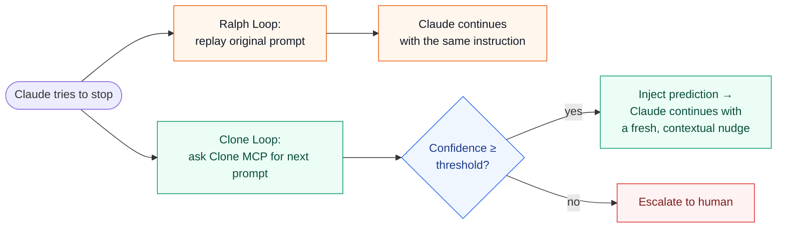

<p align="center">
  <br/>
  <strong>C L O N E</strong>
  <br/><br/>
  <strong>Keep Agent working, with predicted next prompts.</strong>
  <br/>
  <sub>A Claude Code plugin for self-driving coding loops powered by Clone MCP.</sub>
</p>

<p align="center">
  <a href="https://github.com/cloneisyou/clone-loop/tags">
    
  </a>
  
  
  
</p>

<p align="center">
  <a href="#quick-start">Quick Start</a> ·
  <a href="#how-it-works">How It Works</a> ·
  <a href="#commands">Commands</a> ·
  <a href="#api-key">API Key</a> ·
  <a href="#pinning-a-version">Versions</a>
</p>

Clone is a Claude Code plugin that turns any task into a self-driving loop.
When Claude tries to stop, Clone predicts your most likely next prompt and
hands it back to Claude so the work continues — without you having to type
the same nudge ten times.

```text
/clone:loop "Build a REST API for todos. CRUD, validation, tests." --max-iterations 20
```

Then walk away.

## Why people use it

- **Stop typing "yes, keep going."** Clone predicts the obvious next step
  and injects it for you. Threshold-gated so it only auto-continues when
  it's confident.
- **Rich context, not a one-line snapshot.** Each prediction sees your
  original task, every prior iteration's user turn, and a full timeline of
  what Claude did this iteration — text, tool calls, and tool results.
- **AskUserQuestion popups answered automatically** during an active loop.
- **One session, one Claude.** No subprocesses, no daemons, no parallel
  agents to herd.

## Quick start

Paste this into your agent after install:

```text
/clone:loop "Run tests and fix any failures" --max-iterations 5
```

Install - one command, Claude CLI auto-detected:

```bash
curl -fsSL https://raw.githubusercontent.com/cloneisyou/clone-loop/main/scripts/install.sh | bash
```

Or install manually from your shell:

```bash
claude plugin marketplace add cloneisyou/clone-loop@main
claude plugin install clone@clone-loop --scope user
```

PowerShell:

```powershell
claude.exe plugin marketplace add cloneisyou/clone-loop@main
claude.exe plugin install clone@clone-loop --scope user
```

Open your agent and run:

```text
/clone:api-key status
/clone:loop "Run tests and fix any failures" --max-iterations 5
```

Cancel anytime with `/clone:cancel-loop`.

> [!NOTE]
> Clone ships with a public **demo API key** so you can try it in seconds.
> For private memory and your own prediction quality, set `CLONE_API_TOKEN`
> and run `/clone:api-key import-env`.

To update later: `claude plugin marketplace update clone-loop && claude plugin update clone@clone-loop`.

## Commands

| Command | What it does |
|---|---|
| `/clone:loop "<task>" [options]` | Start a loop. |
| `/clone:cancel-loop` | Cancel the active loop. |
| `/clone:api-key status\|import-env\|set\|clear` | Manage your Clone API key. |
| `/clone:help` | Show command help. |

### Options for `/clone:loop`

- `--max-iterations <n>` — stop after N iterations (`0` = unlimited).
  Start small (5–10) while you tune the prompt.
- `--clone-threshold <n>` — confidence threshold in `[0, 1]`. Default `0.6`.
  Below threshold, Clone hands control back to you.
- `--clone-agent "<label>"` — advanced; agent label sent to Clone.

## How it works

1. `/clone:loop` writes a state file and Claude starts the task.
2. When Claude tries to stop, the Stop hook intercepts.
3. The hook asks Clone MCP `predict_next_prompt` for what you'd most likely
   say next.
4. **Above threshold** → prediction injected, Claude continues.
   **Above threshold + satisfaction signal** → loop exits, asks for input.
   **Below threshold** → loop exits, asks for input.
5. Mid-loop `AskUserQuestion` popups are auto-answered the same way.

### What Clone actually sees

- **Your original task prompt** — always preserved verbatim.
- **The conversation so far** — every prior iteration's injected user turn
  plus the assistant timeline that produced it (text + tool calls +
  summarized tool results).
- **What Claude just did** — this iteration's full timeline.

Sane caps: 20-turn rolling window on user history, oldest prior-iter
timelines drop first when the combined size exceeds budget, and long tool
outputs are summarized head + tail. The original prompt and the freshest
iteration are never trimmed.

## Why Clone Loop, not just Ralph Loop?

[Ralph Loop](https://ghuntley.com/ralph/) is the well-known baseline:
when Claude tries to stop, **replay the same prompt**. It works — until
the right next nudge stops being "do what I just said." Tell Claude to
*"Build a REST API"* and the second iteration shouldn't re-read your
spec; it should write tests. The third shouldn't write tests again; it
should fix the failures it just produced.

Clone Loop replaces the replay with a **prediction**: it asks Clone MCP
*"what would the user say next, given the conversation so far?"* — and
only injects that prediction when the model is confident enough. Below
threshold, control returns to you instead of looping on a stale
instruction.



| | Ralph Loop | Clone Loop |
| --- | --- | --- |
| Next prompt | Same as the first one | Predicted from the conversation so far |
| Context sent | None | Original task + every prior user turn + current iteration timeline |
| Safety gate | Max iterations only | Max iterations **+ confidence threshold** |
| Failure mode | Pushes stale instructions until N hits | Stops and asks the human when confidence dips |
| Best fit | Strict retry loops | Iterative work where the next step changes |

## API key

Token resolution order: `CLONE_API_TOKEN` env var → plugin config
(`${CLAUDE_PLUGIN_DATA}/auth.local.json`) → public demo fallback.

```bash
export CLONE_API_TOKEN="clone_xxx"   # or $env:CLONE_API_TOKEN on PowerShell
claude
```

```text
/clone:api-key import-env
/clone:api-key status
```

Prefer `import-env` — `/clone:api-key set <key>` works but the key may
linger in your transcript.

> [!WARNING]
> The demo key is public and shared. Don't use it with private memory.

## Pinning a version

```bash
git clone https://github.com/cloneisyou/clone-loop.git
cd clone-loop
git checkout clone-plugin-v0.3.0   # or any tag from the Releases page
claude --plugin-dir .
```

Tags: see [Releases](https://github.com/cloneisyou/clone-loop/releases).

## Requirements

Claude Code with plugin support, Node.js on `PATH`. Windows: PowerShell
or cmd, no Git Bash needed.

## Development

```bash
pnpm test                                # unit + integration
pnpm run test:mcp:e2e                    # live Clone MCP smoke
node scripts/manual-e2e-multiturn.mjs    # manual rich-context probe
claude plugin validate .
```

> [!IMPORTANT]
> Live MCP tests hit the remote Clone endpoint. Don't record sensitive
> data against the demo fallback.

> [!NOTE]
> The `clone-loop` marketplace is hosted from this repo — not the official
> Anthropic `claude-plugins-official` marketplace.

## License

Apache-2.0.
